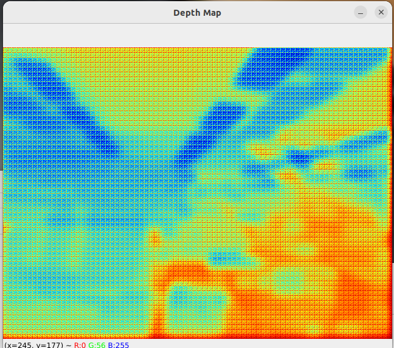

# 2d23dstyle
- Using 2 general web cams to create 3D depth image
- Just enjoying Depth camera imaging. It is not real 3D but looks 3D depth
- low cost toy cam

# Instuction
1. calibration 2cams position

```
python calibration.py

```
- generate 2 npz files from each cam's data
- It will be utilized final step

2. generating npy dataset for training
```
python generate_dataset.py

```
-  disparity_maps.npy and image_pairs.npy are generated for traing

3. Training
- After training pth model file is generated

```
python data_train.py

```

4. inference (3D depth style, we can)


```
python cheapth.py

```
# Image sample


```
# explain article

https://zenn.dev/manyan3/articles/c39b5342e0cb4b
